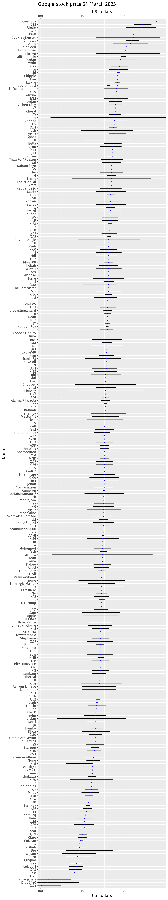
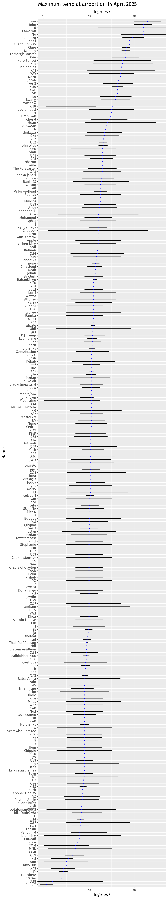
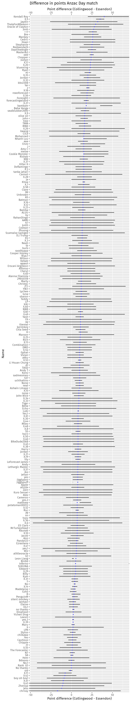
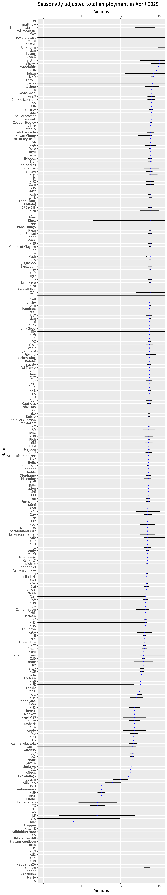
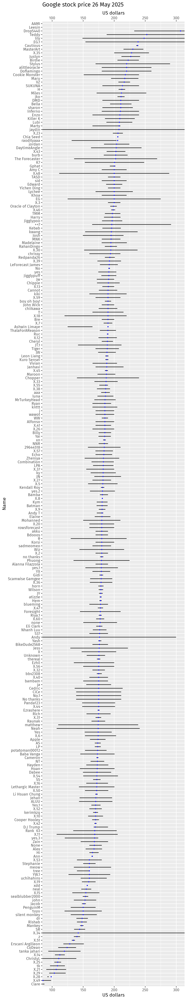

**You must provide forecasts for the following items:**

  1. Google closing stock price in $US on 17 August 2026 [[Data](https://finance.yahoo.com/quote/GOOG/history/)]. 
  2. The difference in runs scored between Australia and Bangladesh in the second cricket test to be held 22-26 August, Mackay. Give result as (Australia total minus Bangladesh total). [[Data]](https://stats.espncricinfo.com/ci/engine/stats/index.html?class=1;opposition=2;opposition=25;orderby=start;team=2;team=25;template=results;type=team;view=match).
  3. Maximum temperature in Celsius at Melbourne airport on 13 September 2026 [[Data](https://www.bom.gov.au/climate/dwo/IDCJDW3049.latest.shtml)]. 
  4. Google closing stock price in $US on 5 October 2026 [[Data](https://finance.yahoo.com/quote/GOOG/history/)]. 
  5. The seasonally adjusted estimate of total employment for September 2026. ABS CAT 6202, to be released on 15 October 2026 [[Data](https://www.abs.gov.au/statistics/labour/employment-and-unemployment/labour-force-australia/latest-release)]. 

**For each of these, give a point forecast and an 80% prediction interval, and explain in a couple of sentences how each was obtained.**

* The [Data] links give you possible data to start with, but you are free to use any data you like.
* There is no need to use any fancy models or sophisticated methods. Simple is better for this assignment. The methods you use should be understandable to any high school student.
* Full marks will be awarded if you submit the required information, and are able to meaningfully justify your results in a sentence or two in each case.
* Once the true values in each case are available, we will come back to this exercise and see who did the best using the scoring method described in class.
* The student with the most accurate forecasts is the winner of our forecasting competition, and will win a $50 cash prize.
* The assignment mark is not dependent on your score.

```{r}
#| output: asis
source(here::here("course_info.R"))
submit(schedule, "Forecasting Competition")
```

<!-- 
## Leaderboard

```{r}
#| eval: true
# source(here::here("assignments/competition.R"))
readRDS(here::here("assignments/competition_leaderboard.rds")) |>
  DT::datatable()
```

## Forecasts

::: {layout-ncol=5}

### Q1
[](Q1.png)

### Q2
[](Q2.png)

### Q3
[](Q3.png)

### Q4
[](Q4.png)

### Q5
[](Q5.png)

:::
 -->